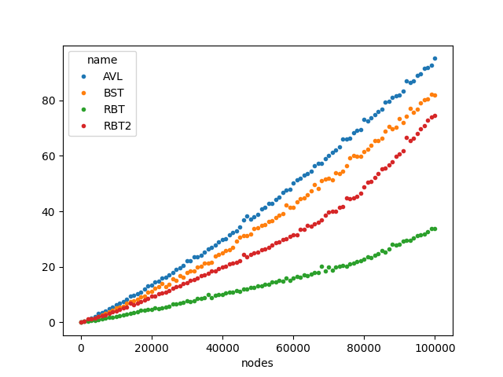
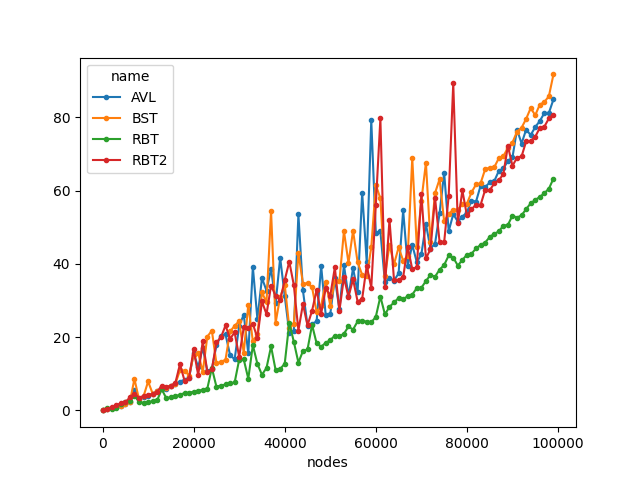
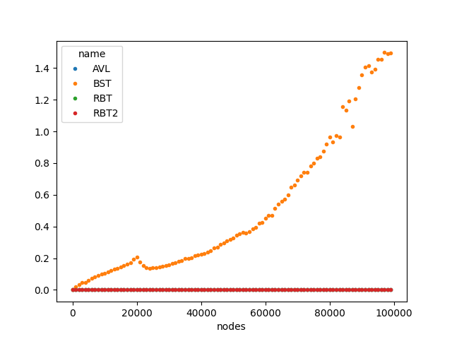

# Benchmark

The Benchmark compare the performance of the operations insertion and search.
The comparisson is between Red-Black Tree (RBT), Binary Search Tree (BST) and
AVL-Tree (AVL).

I used the already implemented trees from the repository [cstuff](https://github.com/lbrito1/cstuff) from the Github User lbrito1. lbrito1 implemented also
a red black tree, so it was an opportunity to compare both trees. The RBT from 
the cstuff-Repository is called RBT2 in the images.

### Insert average-case 

### Insert worst-case

### Search average-case

### Search worst-case
