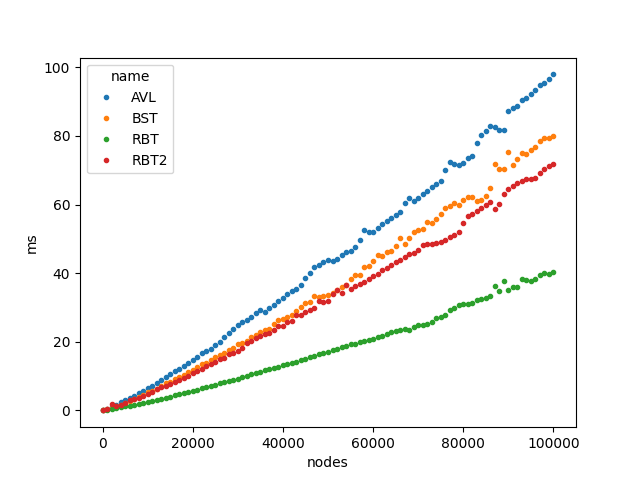
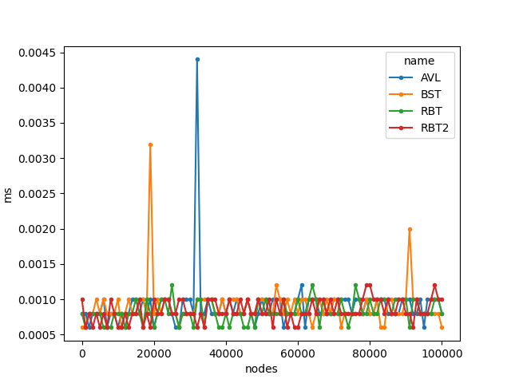
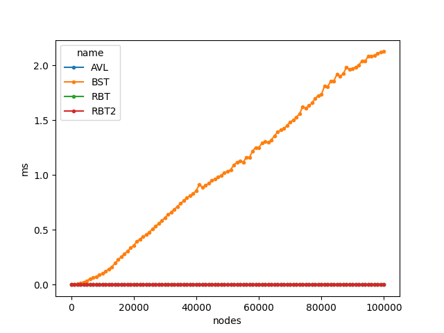

# Benchmark

The Benchmark compare the performance of the operations insertion and search.
The comparisson is between Red-Black Tree (RBT), Binary Search Tree (BST) and
AVL-Tree (AVL).

I used the already implemented trees from the repository 
[cstuff](https://github.com/lbrito1/cstuff) from the Github User lbrito1. 
lbrito1 implemented also a red black tree, so it was an opportunity to compare
both trees. The RBT from the cstuff-Repository is called RBT2 in the images.

AVL and RBT share the same time complexity for in Average and Worst Case, but
BST on the other side have 2 very different possibilities. If the nodes 
are insert randomly (average case), BST shares the same time complexity as 
AVL and RBT, otherwise the BST turns into a linked list and has a linear
time complexity (worst case).

### Insert average-case 

### Search average-case

### Insert worst-case

### Search worst-case
